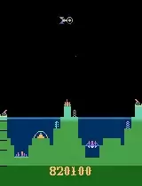
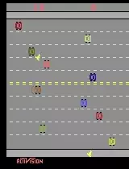
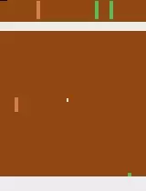
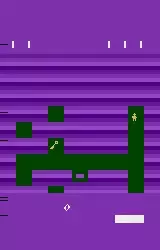

# CloseAI
CloseAI is a deep reinforcement learning agent for Atari games, course project of CS420.

### Introduction

Prior Dueling DQN

## Result

| Environment             | Scores    |
| ----------------------- | --------- |
| PongNoFrameskip-v4      | 20.0      |
| FreewayNoFrameskip-v4   | 30.5      |
| AtlantisNoFrameskip-v4  | 2705425.0 |
| TutankhamNoFrameskip-v4 | 265.3     |
| KrullNoFrameskip-v4     | 11135.0   |

## Gallery

|                   Atlantis                   |                   Freeway                   |                     Krull                     |                   Pong                   |                   Tutankham                   |
| :------------------------------------------: | :-----------------------------------------: | :-------------------------------------------: | :--------------------------------------: | :-------------------------------------------: |
|  |  |  |  |  |

